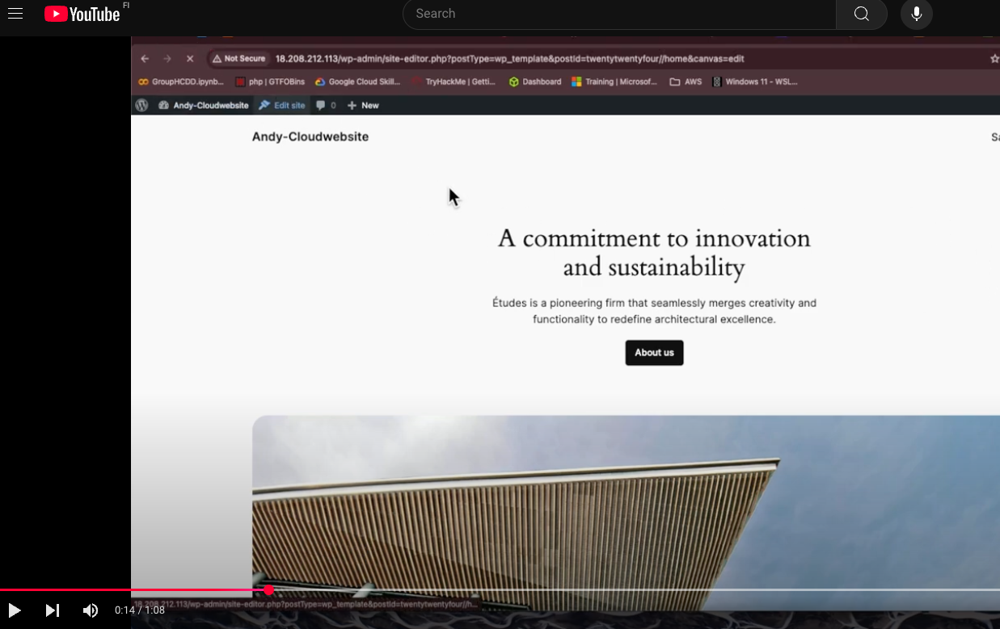
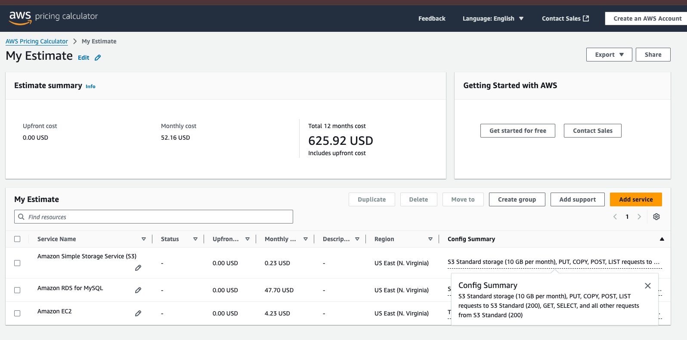

# 1.	Video for Deploying and managing a WordPress website using AWS

**Click to picture to see the video of Deploying and managing a WordPress website using AWS**

## 2.	Cost Management part:

Amazon EC2 cost 

Amazon RDS for MySQL cost

 
Amazon Simple Storage Service (S3) cost

